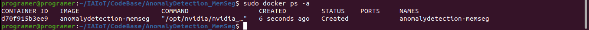
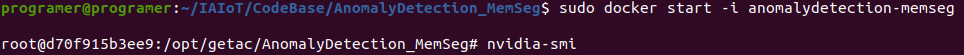
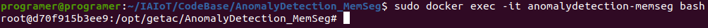
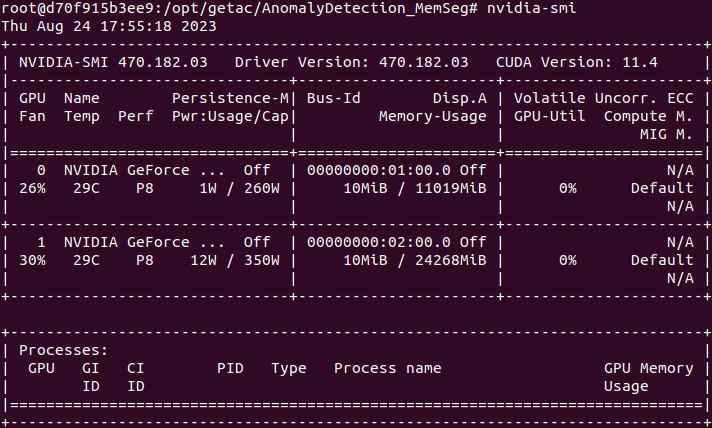
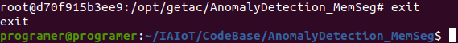
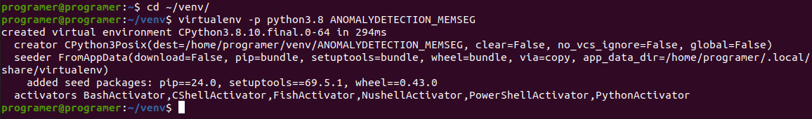
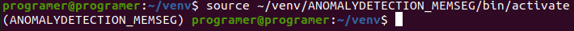
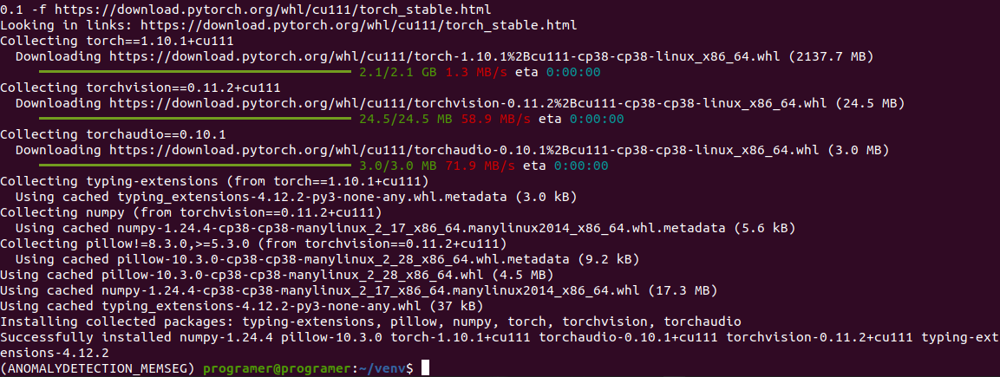
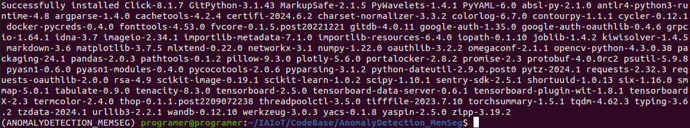
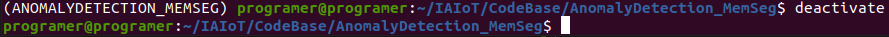

# Installation

<!-- TOC -->

- [Installation](#installation)
    - [Pre-settings](#pre-settings)
    - [Git Clone](#git-clone)
    - [Install Environments](#install-environments)
        - [Install environments with docker Linux](#install-environments-with-docker-linux)
        - [Install environments with virtualenv Linux](#install-environments-with-virtualenv-linux)

<!-- /TOC -->

</br>

## Pre-settings
- Ubuntu20.04 amd64 Desktop
- NVIDIA GPU (GTX2080Ti / RTX3090 測試過可以)
- NVIDIA GPU Driver (525.105.17)
- Docker and NVIDIA Docker
- Visual Studio Code
- Git
- 硬碟與資料夾設定

</br>

## Git Clone
- 開啟 terminal (Ctrl+Alt+T)
- 開啟欲下載程式碼的位置 (自己定義)
    ```shell
    mkdir ~/code
    cd ~/code
    ```

- 下載程式碼
    ```shell
    git clone https://github.com/simonyang0608/DeeperSimon.git
    ``` 

</br>

## Install Environments
### Install environments with docker (Linux)
- 進入程式碼
    ```shell
    cd ~/code/AnomalyDetection_MemSeg
    ```

    </br>

- 建置 Docker Image

    這個步驟會依照 [~/code/AnomalyDetection_MemSeg/Dockerfile](./Dockerfile) 中定義的步驟進行, 必須加`--network=host` 因為過程中需要連網路下載檔案, 最後面的`.`也需要, 表示於當前目錄中執行
    ```shell
    sudo docker build --network=host -t anomalydetection-memseg .
    ```

</br>

- (optional) 解釋一下 Dockerfile 中安裝了什麼
    | Name | Description |
    | ---- | ----------- |
    | nvidia/cuda:11.3.1-cudnn8-runtime-ubuntu20.04 | OS with cuda/cudnn |
    | basic library | 基本函式庫 |
    | nvidia-docker | NVIDIA docker 函式庫 |
    | python3.8 | Python |
    | pyTorch 1.10.1+cu111 | PyTorch |
    | requirements.txt | 會用到的第三方函式庫 |

</br>

- 創立 Docker Container
    ```shell
    sudo docker create -i -t \
        -v /mnt/HDD/:/mnt/HDD/ \
        -v /mnt/SSD/:/mnt/SSD/ \
        -v /home/:/home/ \
        -v /home/:/home/ \
        --shm-size 8G \
        --gpus all \
        -e TZ=Asia/Taipei \
        -e NVIDIA_VISIBLE_DEVICES=0,1 \
        --name anomalydetection-memseg anomalydetection-memseg
    ```

    | Name | Description | How to use |
    | ---- | ----------- | ---------- |
    | -v | 映射 volumn | <host_path>:<container_path> |
    | -w | 預設路徑 workdir | <default_container_path> |
    | --shm-size | 記憶體大小 | 預設為 8G, 使用上沒有什麼問題 |
    | --gpus | GPU ID | 設定 container 中可以使用哪些 GPU |
    | -e | 環境變數 | 設定 NVIDIA_VISIBLE_DEVICES, 可以被看到哪些 GPU |
    | --name | Image Name | 這個 container 要採用哪個 Docker Image |
    | 最後一個 args (anomalydetection-memseg) | Container Name | 這個 container 的名稱 |

    </br>

    可以用指令確認是否創建成功
    ```shell
    sudo docker ps -a
    ```
    

</br>

- 啟動 container, 啟動後會一併進入 container 中的環境

    ```shell
    sudo docker start -i anomalydetection-memseg
    ```
    

</br>

- (Optional) 如果要再開同一個 container, 可以使用以下指令

    ```shell
    sudo docker exec -it anomalydetection-memseg bash
    ```
    

</br>

- 已經成功進入了, 可以簡單檢查一下 container 內是否可讀到 NVIDIA GPU

    ```shell
    nvidia-smi
    ```
    

</br>

- 確認 python3 pip list
    ```shell
    pip3 list
    ```
    得到以下結果 :

    ```shell
    Package                   Version             
    ------------------------- --------------------
    absl-py                   1.4.0               
    altgraph                  0.17.4              
    antlr4-python3-runtime    4.8                 
    cachetools                4.2.4               
    certifi                   2019.11.28          
    chardet                   3.0.4               
    charset-normalizer        3.3.2               
    click                     8.1.7               
    cmake                     3.27.2              
    colorlog                  6.7.0               
    contourpy                 1.1.0               
    cycler                    0.11.0              
    dbus-python               1.2.16              
    distro-info               0.23ubuntu1         
    docker-pycreds            0.4.0               
    filelock                  3.12.2              
    fonttools                 4.42.1              
    fvcore                    0.1.5.post20221221  
    gitdb                     4.0.10              
    GitPython                 3.1.32              
    google-auth               1.35.0              
    google-auth-oauthlib      0.4.6               
    grpcio                    1.57.0              
    hub-sdk                   0.0.2               
    idna                      2.8                 
    imageio                   2.31.1              
    importlib-metadata        6.8.0               
    importlib-resources       6.0.1               
    iopath                    0.1.10              
    Jinja2                    3.1.2               
    joblib                    1.3.2               
    kiwisolver                1.4.4               
    lightning-utilities       0.10.1              
    lit                       16.0.6              
    Markdown                  3.4.4               
    MarkupSafe                2.1.3               
    matplotlib                3.7.2               
    mlxtend                   0.22.0              
    mpmath                    1.3.0               
    networkx                  3.1                 
    numpy                     1.22.0              
    nvidia-cublas-cu11        11.10.3.66          
    nvidia-cuda-cupti-cu11    11.7.101            
    nvidia-cuda-nvrtc-cu11    11.7.99             
    nvidia-cuda-runtime-cu11  11.7.99             
    nvidia-cudnn-cu11         8.5.0.96            
    nvidia-cufft-cu11         10.9.0.58           
    nvidia-curand-cu11        10.2.10.91          
    nvidia-cusolver-cu11      11.4.0.1            
    nvidia-cusparse-cu11      11.7.4.91           
    nvidia-nccl-cu11          2.14.3              
    nvidia-nvtx-cu11          11.7.91             
    oauthlib                  3.2.2               
    omegaconf                 2.1.1               
    opencv-python             4.9.0.80            
    packaging                 23.1                
    pandas                    2.0.3               
    pathtools                 0.1.2               
    Pillow                    9.3.0               
    pip                       20.0.2              
    plotly                    5.6.0               
    portalocker               2.7.0               
    promise                   2.3                 
    protobuf                  4.0.0rc2            
    psutil                    5.9.5               
    py-cpuinfo                9.0.0               
    pyasn1                    0.5.0               
    pyasn1-modules            0.3.0               
    pycocotools               2.0.6               
    PyGObject                 3.36.0              
    pyinstaller               6.3.0               
    pyinstaller-hooks-contrib 2023.10             
    pyparsing                 3.0.9               
    python-apt                2.0.1+ubuntu0.20.4.1
    python-dateutil           2.8.2               
    pytz                      2023.3              
    PyWavelets                1.4.1               
    PyYAML                    6.0                 
    requests                  2.31.0              
    requests-oauthlib         1.3.1               
    requests-unixsocket       0.2.0               
    rsa                       4.9                 
    scikit-image              0.19.1              
    scikit-learn              1.0.2               
    scipy                     1.10.1              
    seaborn                   0.13.1              
    sentry-sdk                1.29.2              
    setuptools                45.2.0              
    shortuuid                 1.0.11              
    six                       1.14.0              
    smmap                     5.0.0               
    sympy                     1.12                
    tabulate                  0.9.0               
    tenacity                  8.2.3               
    tensorboard               2.5.0               
    tensorboard-data-server   0.6.1               
    tensorboard-plugin-wit    1.8.1               
    tensorboardX              2.3                 
    termcolor                 2.3.0               
    thop                      0.1.1.post2209072238
    threadpoolctl             3.2.0               
    tifffile                  2023.7.10           
    torch                     1.10.1+cu111        
    torchaudio                0.10.1+cu111        
    torchsummary              1.5.1               
    torchvision               0.11.2+cu111        
    tqdm                      4.66.1              
    triton                    2.0.0               
    typing-extensions         4.9.0               
    tzdata                    2023.3              
    unattended-upgrades       0.1                 
    urllib3                   2.0.4               
    wandb                     0.12.10             
    werkzeug                  2.3.7               
    wheel                     0.34.2              
    yacs                      0.1.8               
    yaspin                    2.5.0               
    zipp                      3.16.2
    ```

</br>

- 若需要退出 container 可以輸入 `exit` 離開並停止 container

    ```shell
    exit
    ```
    

</br>

### Install environments with virtualenv (Linux)
- 下載並安裝 Nvidia 驅動裝置 (driver)

    See [Install Ubuntu20.04 NVIDIA Driver](https://tfs.getac.com/tfs/IAIoT_Collection/IAIoT-AI%20Team/_git/IAIoT-AI%20Team?path=%2FInstallUbuntu20.04NVIDIADriver%2FREADME.md&version=GBmaster) for more details. 如果已經安裝過了, 可以跳過這個步驟

- 下載並安裝 CUDA 11.3.1 版本

- 下載並安裝 python 3.8 版本
    ```shell
    sudo apt-get install python3.8
    sudo apt-get install python3.8-dev
    sudo apt-get install python3.8-distutils
    sudo apt-get install python3.8-venv
    ```

    </br>

- 創立 python3 virtual environment (i.e. 虛擬環境)
    ```shell
    mkdir ~/venv
    cd ~/venv
    virtualenv -p python3.8 ANOMALYDETECTION_MEMSEG
    ```
    

    </br>

- Activate 並進入 python3 virtual environment
    ```shell
    source ~/venv/ANOMALYDETECTION_MEMSEG/bin/activate
    ```
    

    </br>

- 安裝 pytorch 1.10.1 + cu111 版本套件/框架
    ```shell
    pip3 install torch==1.10.1+cu111 torchvision==0.11.2+cu111 torchaudio==0.10.1 -f https://download.pytorch.org/whl/cu111/torch_stable.html
    ```
    

    </br>

- 安裝其他 python3 套件/框架
    ```shell
    cd ~/IAIoT/CodeBase/AnomalyDetection_MemSeg
    pip3 install -r requirements.txt
    ```
    

    </br>

- 確認 python3 pip list
    ```shell
    pip3 list
    ```
    得到以下結果 :

    ```shell
    Package                 Version
    ----------------------- --------------------
    absl-py                 2.1.0
    antlr4-python3-runtime  4.8
    cachetools              4.2.4
    certifi                 2024.6.2
    charset-normalizer      3.3.2
    click                   8.1.7
    colorlog                6.7.0
    contourpy               1.1.1
    cycler                  0.12.1
    docker-pycreds          0.4.0
    fonttools               4.53.0
    fvcore                  0.1.5.post20221221
    gitdb                   4.0.11
    GitPython               3.1.43
    google-auth             1.35.0
    google-auth-oauthlib    0.4.6
    grpcio                  1.64.1
    idna                    3.7
    imageio                 2.34.1
    importlib_metadata      7.1.0
    importlib_resources     6.4.0
    iopath                  0.1.10
    joblib                  1.4.2
    kiwisolver              1.4.5
    Markdown                3.6
    MarkupSafe              2.1.5
    matplotlib              3.7.5
    mlxtend                 0.22.0
    networkx                3.1
    numpy                   1.22.0
    oauthlib                3.2.2
    omegaconf               2.1.1
    opencv-python           4.3.0.38
    packaging               24.1
    pandas                  2.0.3
    pathtools               0.1.2
    Pillow                  9.3.0
    pip                     24.0
    plotly                  5.6.0
    portalocker             2.8.2
    promise                 2.3
    protobuf                4.0.0rc2
    psutil                  5.9.8
    pyasn1                  0.6.0
    pyasn1_modules          0.4.0
    pycocotools             2.0.6
    pyparsing               3.1.2
    python-dateutil         2.9.0.post0
    pytz                    2024.1
    PyWavelets              1.4.1
    PyYAML                  6.0
    requests                2.32.3
    requests-oauthlib       2.0.0
    rsa                     4.9
    scikit-image            0.19.1
    scikit-learn            1.0.2
    scipy                   1.10.1
    sentry-sdk              2.5.1
    setuptools              69.5.1
    shortuuid               1.0.13
    six                     1.16.0
    smmap                   5.0.1
    tabulate                0.9.0
    tenacity                8.3.0
    tensorboard             2.5.0
    tensorboard-data-server 0.6.1
    tensorboard-plugin-wit  1.8.1
    tensorboardX            2.3
    termcolor               2.4.0
    thop                    0.1.1.post2209072238
    threadpoolctl           3.5.0
    tifffile                2023.7.10
    torch                   1.10.1+cu111
    torchaudio              0.10.1+cu111
    torchsummary            1.5.1
    torchvision             0.11.2+cu111
    tqdm                    4.62.3
    typing                  3.6.2
    typing_extensions       4.12.2
    tzdata                  2024.1
    urllib3                 2.2.1
    wandb                   0.12.10
    Werkzeug                3.0.3
    wheel                   0.43.0
    yacs                    0.1.8
    yaspin                  2.5.0
    zipp                    3.19.2
    ```

    </br>

- (Optional) 若需要退出 python3 virtual environment, 可以輸入以下指令
    ```shell
    deactivate
    ```
    


