# DeeperSimon
DeeperSimon is an AI defect detection engine based on MemSeg open source. See [https://github.com/TooTouch/MemSeg](https://github.com/TooTouch/MemSeg) for more details.

<!-- TOC -->

- [DeeperSimon](#deepersimon)
  - [Release Notes](#release-notes)
  - [Installation](#installation)
  - [Main process flow (Pipeline)](#main-process-flow-pipeline)
    - [Config settings (Config 參數檔設定)](#config-settings-config-參數檔設定)
    - [Dataset preprocess (資料集前處理)](#dataset-preprocess-資料集前處理)
    - [Model construct (模型建構)](#model-construct-模型建構)
        - [Block function](#block-function)
        - [Backbone and Decoder](#backbone-and-decoder)
    - [Model train and validate (模型訓練及驗證)](#model-train-and-validate-模型訓練及驗證)
        - [Loss function](#loss-function)
        - [Optimizer](#optimizer)
        - [Learning rate scheduler](#learning-rate-scheduler)
        - [Original train](#original-train)
        - [Pretrained train](#pretrained-train)
        - [Resume train](#resume-train)
        - [Visualized results](#visualized-results)
    - [Model inference (模型推論)](#model-inference-模型推論)
        - [Dataset loader](#dataset-loader)
        - [Image folder](#image-folder)
    - [Model export (模型匯出)](#model-export-模型匯出)
  - [Log](#log)

<!-- /TOC -->

</br>

## Main process flow (Pipeline)
- 程式檔: [Main.py](Main.py)

- 功能: 統一的主程式(Main)流程, 包含: 1.資料集(Dataset), 2.模型(Model), 3.訓練及驗證(Train/Validate), 4.推論(Inference), 5.匯出(Export)部份等步驟流程, 如下圖所示:

    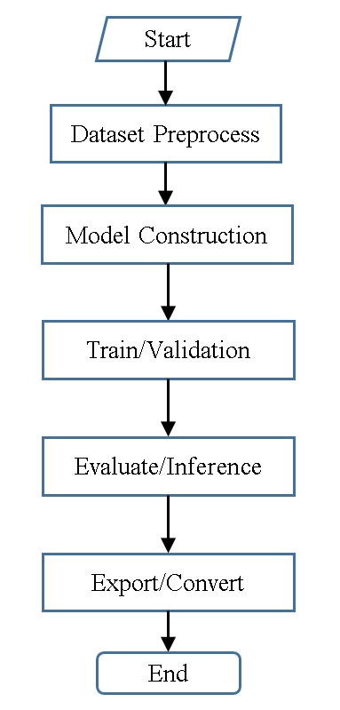

</br>

### Config settings (Config 參數檔設定)
- 參數檔: [Config/LIOHO/Baking_Paint/Satellite_Pedestal/Segmentation/Defect.yaml](Config/LIOHO/Baking_Paint/Satellite_Pedestal/Segmentation/Defect.yaml)

- 功能: 執行主流程前的整體初始化參數設定, 包含: 1.輸入影像(Images) 2.資料集(Dataset), 3.模型(Model), 4.學習參數(Learning parameters), 5.裝置(Device), 6.匯出(Export)等, ...

</br>

### Dataset preprocess (資料集前處理)
- 程式檔: [Data/Dataset_Mapper.py](Data/Dataset_Mapper.py)

- 功能: 執行資料集前處理, 透過資料擴增/增強(Augmentation)技術, 對不良品(NG samples)及良品(PASS samples)的類別數量進行平衡, 藉此多樣化/多量化資料集, 整體流程如下圖所示:

    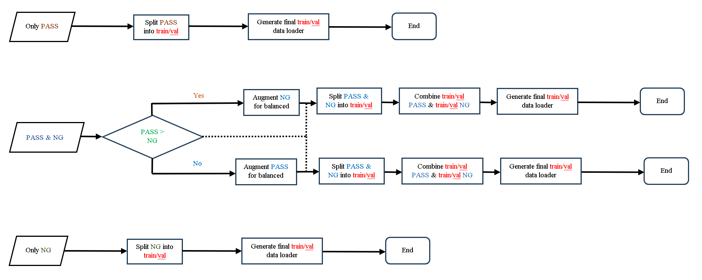

- 參數檔位置:

    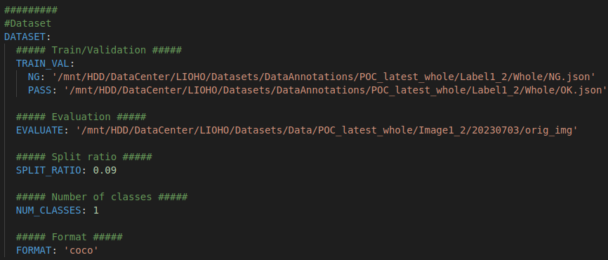

</br>

### Model construct (模型建構)
- 程式檔: [Model/Meta_Networker/Segmentor/FCOS.py](Model/Meta_Networker/Segmentor/FCOS.py)

- 功能: 利用定義好的神經網路模組(Module/Block), 層(Layer), 激活函數(Activation function), 編碼器(Backbone), 解碼器(Decoder)等, ..., 對適切不同任務的模型架構進行拼接組建以及重構, 整體佈局如下圖所示:

    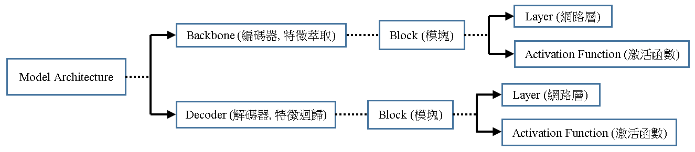

- 參數檔位置:

    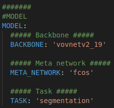

#### Block function
- 程式檔: [Model/Global_Builder/Module.py](Model/Global_Builder/Module.py)

- 功能: 利用定義好的正歸化(Normalization)函數, 激活函數(Activation function)等, ..., 對不同神經網路模組(Module/Block)進行拼接組建以及重構, 整體流程如下圖所示:

    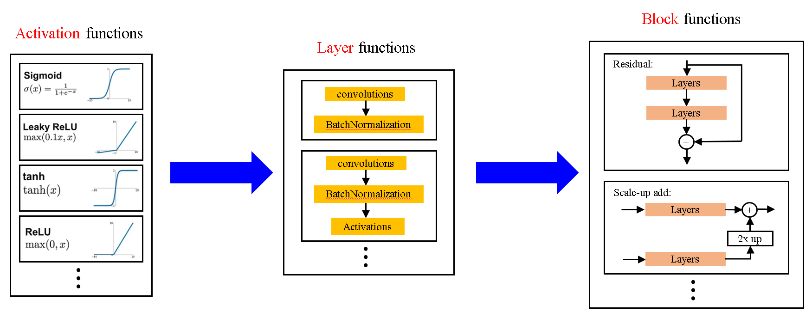

#### Backbone and Decoder
- 程式檔: [Model/Backbone/VoVNet.py](Model/Backbone/VoVNet.py), [Model/Decoder/FPN.py](Model/Decoder/FPN.py)

- 功能: 利用定義好的不同神經網路模組(Module/Block), 對不同編碼器(Backbone)及解碼器(Decoder)進行拼接組建以及重構, 整體流程如下圖所示:

    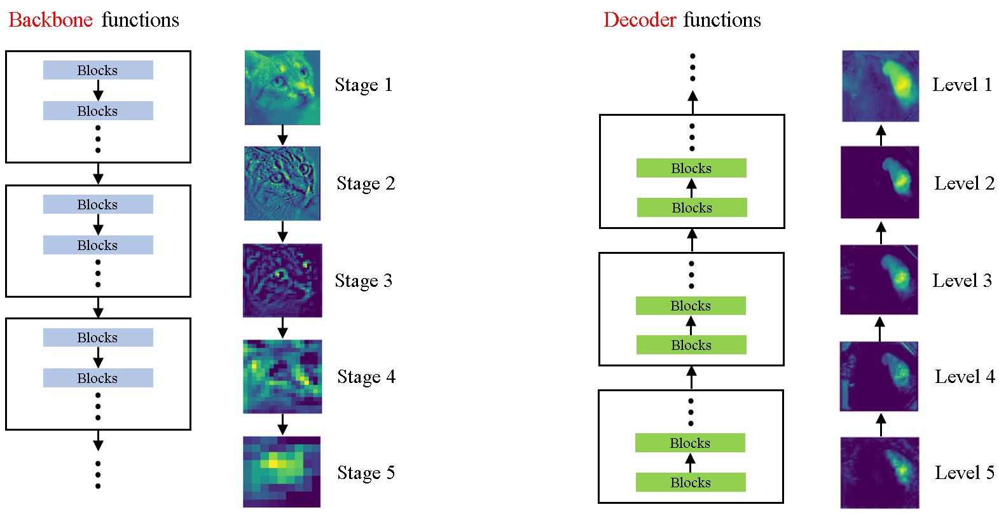

</br>

### Model train and validate (模型訓練及驗證)
- 程式檔: [Trainer.py](Trainer.py)

- 功能: 利用定義/建構好的主任務模型架構, 搭配損失函數(Loss function), 優化器(Optimizer), 學習率調變(Learning rate scheduler)等優化方法, 對於訓練/驗證集(Train/Validate dataset)進行前傳遞(Feed-forward pass)/倒傳遞(Back-propagaion pass)的訓練機制, 主要分成初始化參數訓練(Original train), 預訓練(Pretrained train)及持續訓練(Resume train), 藉此優化/調整模型權重參數, 達到最終學習收斂的目的, 請查詢 [細節解析/說明](https://en.wikipedia.org/wiki/Backpropagation) 以取得更多詳細的資訊

- 訓練/驗證集參數檔位置:

    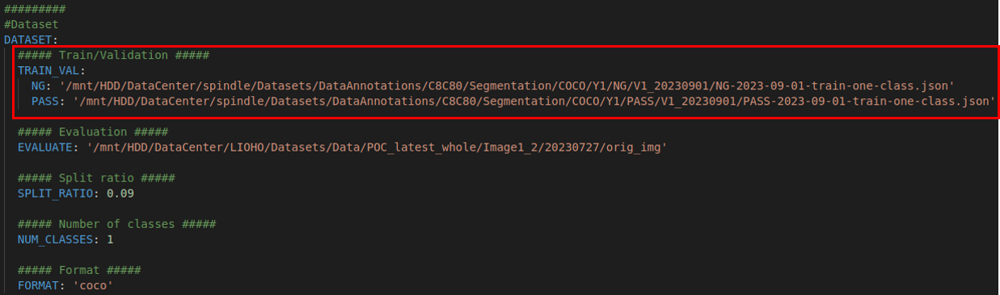

- 實驗紀錄/存檔路徑參數檔位置:

    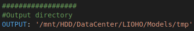

#### Loss function
- 程式檔: [Loss/Loss_Function.py](Loss/Loss_Function.py)

- 功能: 為損失函數, 主要對於模型於訓練過程中錯誤的參數調教/決策進行懲罰機制, 藉此達到最終學習收斂的目的, 請查詢 [細節解析/說明](https://en.wikipedia.org/wiki/Loss_function) 以取得更多詳細的資訊

- 參數檔位置:

    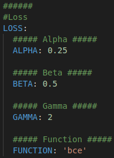

#### Optimizer
- 程式檔: [Optimizer/Optimizer.py](Optimizer/Optimizer.py)

- 功能: 為優化器, 主要利用已取得並計算好的倒傳遞後梯度相關數值, 對於模型的權重參數進行調整與更新, 藉此達到最終學習收斂的目的, 請查詢 [細節解析/說明](https://chih-sheng-huang821.medium.com/%E6%A9%9F%E5%99%A8%E5%AD%B8%E7%BF%92-%E5%9F%BA%E7%A4%8E%E6%95%B8%E5%AD%B8-%E4%B8%89-%E6%A2%AF%E5%BA%A6%E6%9C%80%E4%BD%B3%E8%A7%A3%E7%9B%B8%E9%97%9C%E7%AE%97%E6%B3%95-gradient-descent-optimization-algorithms-b61ed1478bd7) 以取得更多詳細的資訊

- 參數檔位置:

    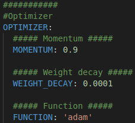

#### Learning rate scheduler
- 程式檔: [Optimizer/LR_Scheduler.py](Optimizer/LR_Scheduler.py)

- 功能: 為一對學習率進行動態調整的機制, 使的模型能更快速有效的擬合數據及收斂, 藉此達到最終學習收斂的目的, 請查詢 [細節解析/說明](https://en.wikipedia.org/wiki/Learning_rate) 以取得更多詳細的資訊

- 參數檔位置: 

    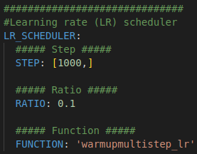

#### Original train
- 指令檔: [main_flow.sh](main_flow.sh)

- 功能: 意即所謂的從頭開始訓練 (i.e. 初始化權重及自定義的學習參數), 適用於全新資料集的訓練, 訓練時程較長, 整體流程如下圖所示:

    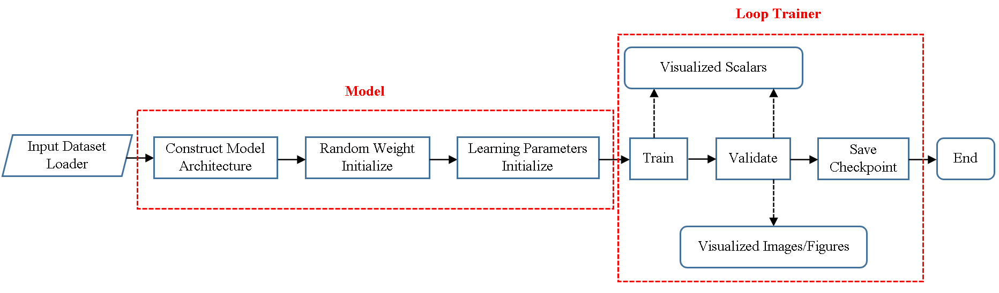

- 執行訓練流程: 

    進入到指令檔內部後, 註解掉除了 original train 以外的其他相關指令, 如下圖所示:

    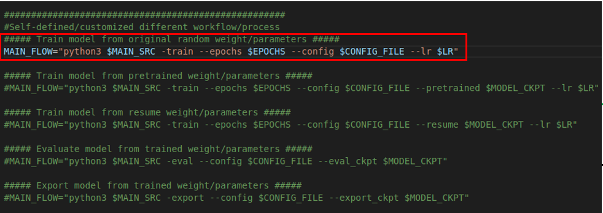

    接著再於終端 (terminal) 執行以下指令:
    ```shell
    ./main_flow.sh
    ```
    完成後即可即時查看訓練進度條細節資訊, 如下圖所示:

    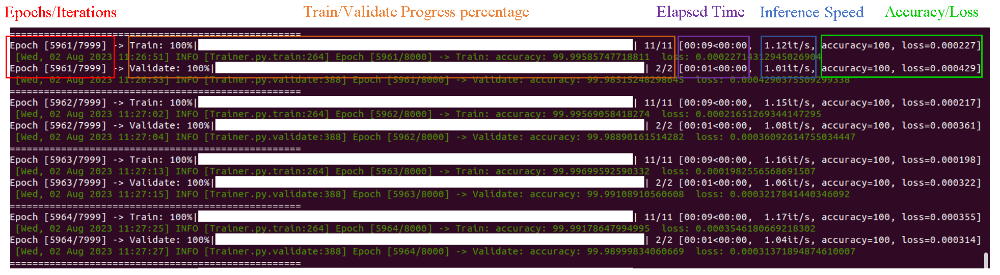

    同時也可進入設定的實驗紀錄/存檔路徑查看訓練後模型的存取資訊, 如下圖所示:
    ```shell
    cd path_to_output_dir/train_result
    ```
    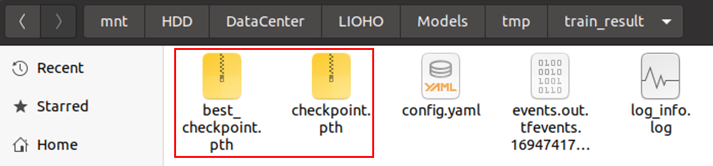


#### Pretrained train
- 指令檔: [main_flow.sh](main_flow.sh)

- 功能: 意即所謂的預訓練 (i.e. 事先訓練過後的權重及初始化自定義的學習參數), 適用於新增資料於舊資料集的訓練, 訓練時程較短, 整體流程如下圖所示:

    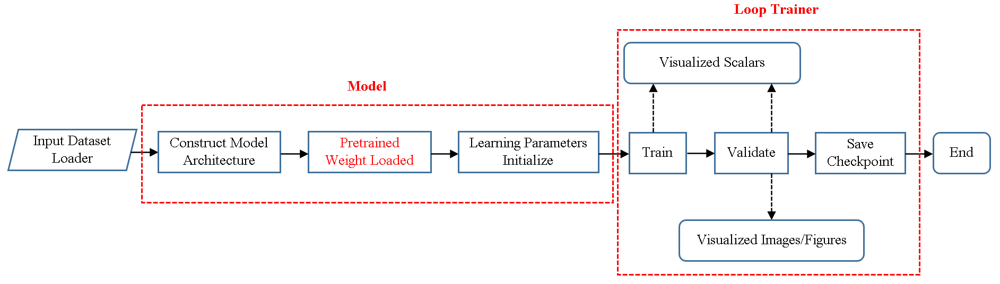

- 執行訓練流程: 

    進入到指令檔內部後, 註解掉除了 pretrained train 以外的其他相關指令, 如下圖所示:

    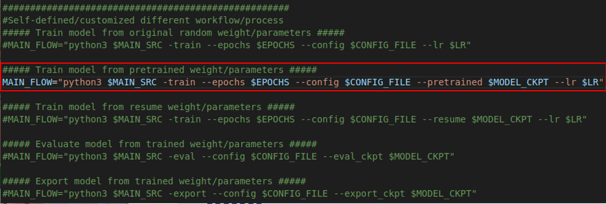

    接著再於終端 (terminal) 執行以下指令:
    ```shell
    ./main_flow.sh
    ```
    完成後即可即時查看訓練進度條細節資訊, 如下圖所示:

    

    同時也可進入設定的實驗紀錄/存檔路徑查看訓練後模型的存取資訊, 如下圖所示:
    ```shell
    cd path_to_output_dir/train_result
    ```
    

#### Resume train
- 指令檔: [main_flow.sh](main_flow.sh)

- 功能: 意即所謂的持續訓練 (i.e. 訓練過程中/後的權重及學習參數狀態), 適用於原/舊資料集的訓練, 訓練時程視情況可長可短, 整體流程如下圖所示:

    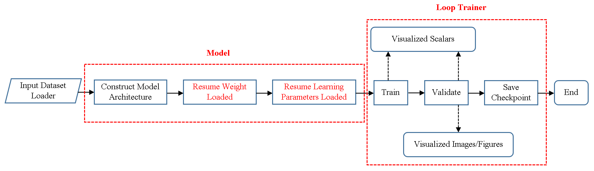

- 執行訓練流程: 

    進入到指令檔內部後, 註解掉除了 resume train 以外的其他相關指令, 如下圖所示:

    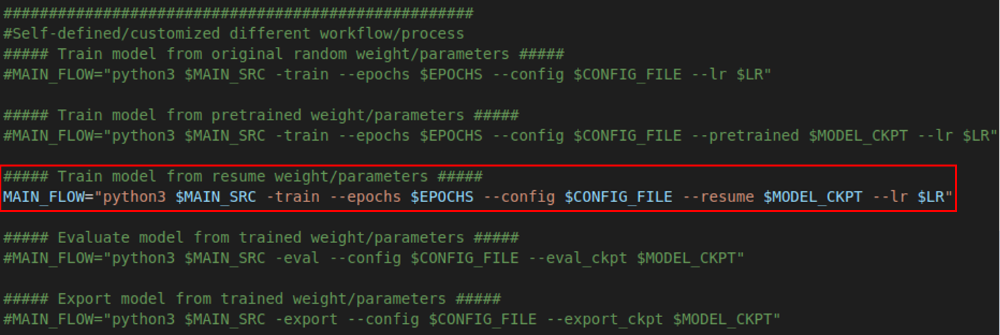

    接著再於終端 (terminal) 執行以下指令:
    ```shell
    ./main_flow.sh
    ```
    完成後即可即時查看訓練進度條細節資訊, 如下圖所示:

    

    同時也可進入設定的實驗紀錄/存檔路徑查看訓練後模型的存取資訊, 如下圖所示:
    ```shell
    cd path_to_output_dir/train_result
    ```
    

#### Visualized results
- 功能: 訓練過程中的所有可視化結果紀錄, 包括準確度(Accuracy), 損失(Loss), 學習率動態變化, 影像推論結果(Image inference results), 評估指標(Metrics)等, ...

- 執行入介面操作流程: 

    首先於終端執行以下指令, 進入到設定的實驗紀錄/存有 Tensorboard event 文件的存檔路徑中:
    ```shell
    cd path_to_output_dir/train_result
    ```
    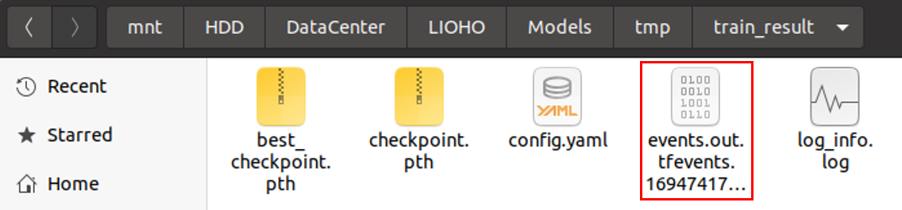

    接著執行以下指令, 進入到 Tensorboard 前端可視化界面:
    ```shell
    tensorboard --logdir="." --host=0.0.0.0
    ```
    最後可以看到以下網路連結資訊, 點擊進入:

    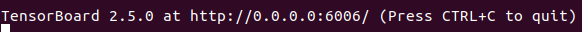

- 可視化紀錄:
    - 準確度(Accuracy):

        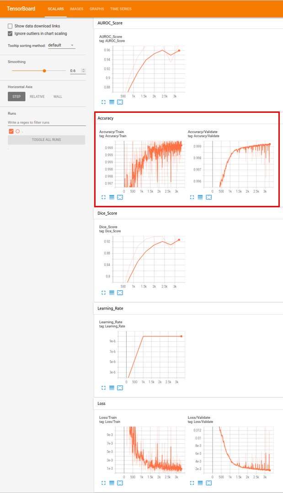

    - 損失(Loss):

        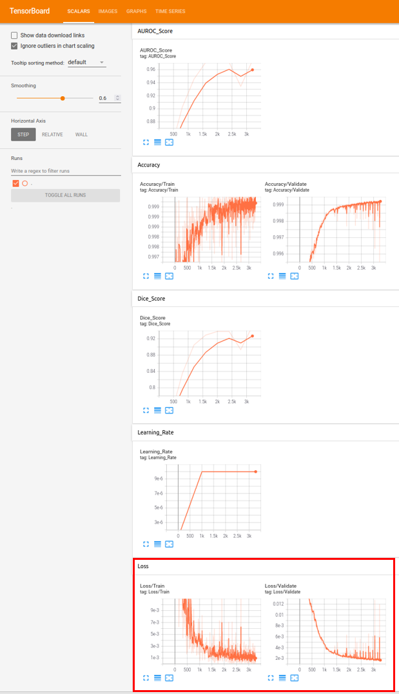

    - 學習率動態變化:

        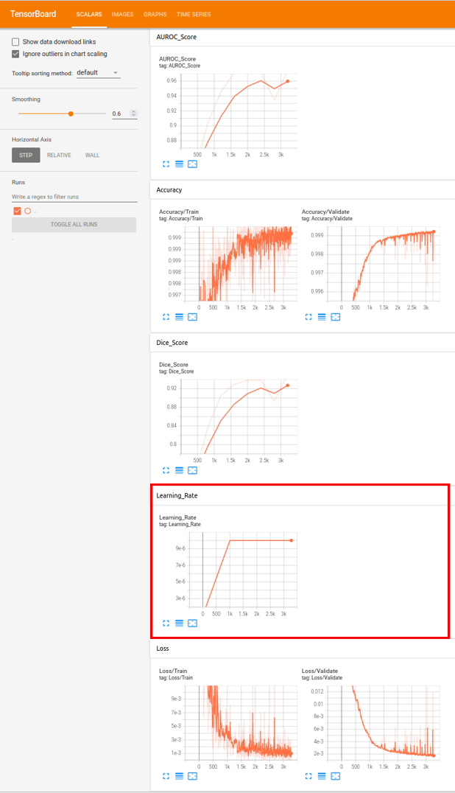

    - 影像推論結果(Image inference results):

        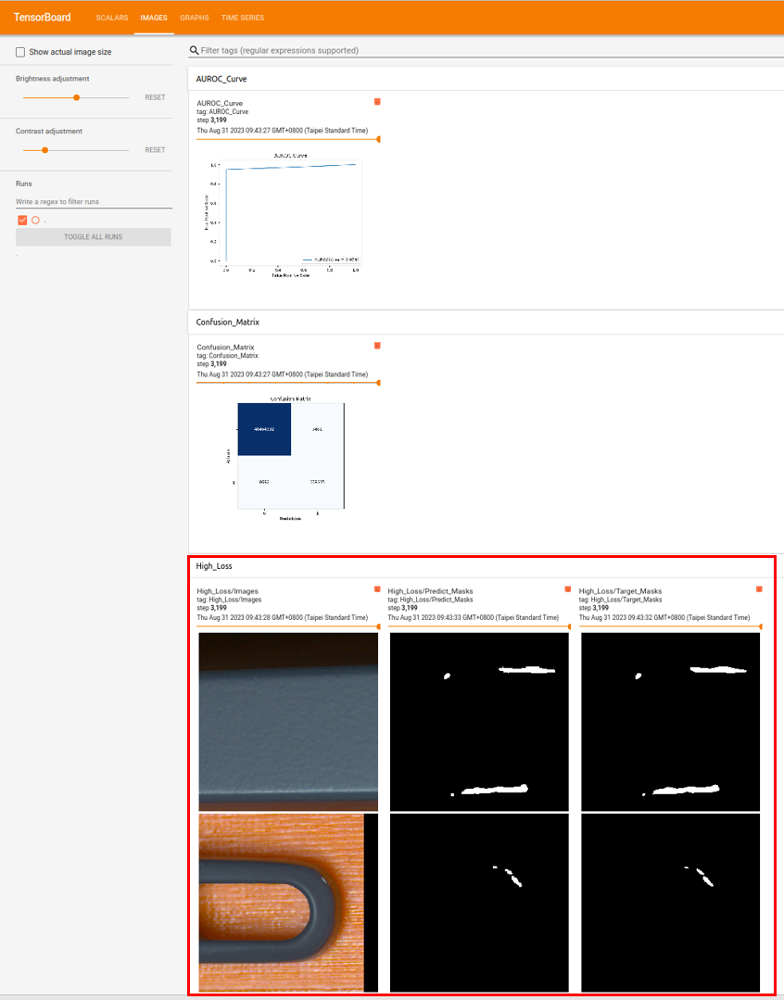

    - 評估指標(Metrics):
        1. Area under ROC curve (i.e. AUROC) Score: 

            0~1之間的面積分數值, 越接近1代表模型表現越好, 請查詢 [細節解析/說明](https://en.wikipedia.org/wiki/Receiver_operating_characteristic) 以取得更多詳細的資訊

            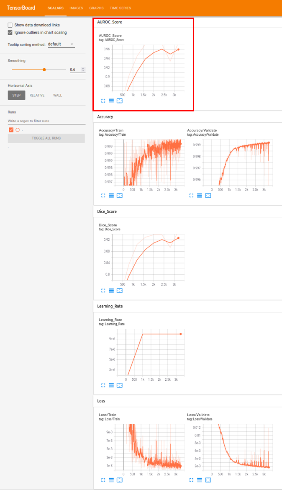

        2. Dice Score:

            0~1之間的分數值, 越接近1代表模型表現越好, 請查詢 [細節解析/說明](https://zh.wikipedia.org/zh-tw/Dice%E7%B3%BB%E6%95%B0) 以取得更多詳細的資訊

            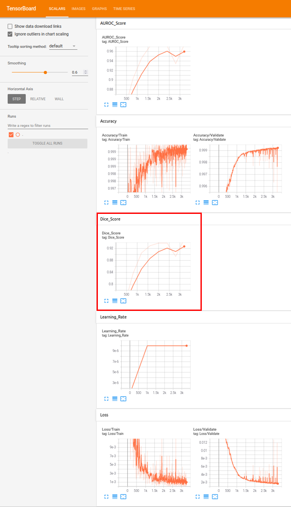

        3. Area under ROC curve (i.e. AUROC) Curve:

            0~1之間的面積分數值, 越接近1代表模型表現越好, 請查詢 [細節解析/說明](https://en.wikipedia.org/wiki/Receiver_operating_characteristic) 以取得更多詳細的資訊

            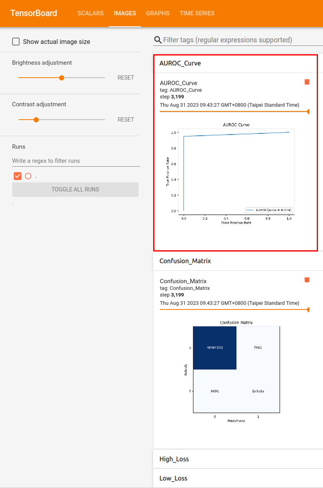

        4. Confusion Matrix:

            矩形陣列數值分佈, 左上到右下數值越大 (i.e. 表示右上到左下數值越小) 代表模型表現越好, 請查詢 [細節解析/說明](https://en.wikipedia.org/wiki/Confusion_matrix) 以取得更多詳細的資訊

            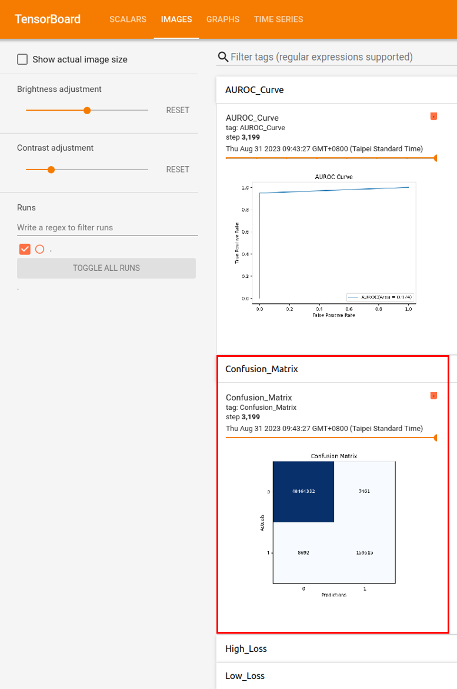

</br>

### Model inference (模型推論)
- 程式檔: [Evaluater.py](Evaluater.py)

- 功能: 利用已訓練好的主任務模型架構進行測試集(Test/Evaluate dataset)的推論驗證, 主要是針對資料載入集(Dataset loader)或影像路徑夾(Image folder)進行推論, 並於終端, Tensorboard前端, 路徑文件夾端等, ..., 輸出可視化紀錄結果

- 測試集參數檔位置:

    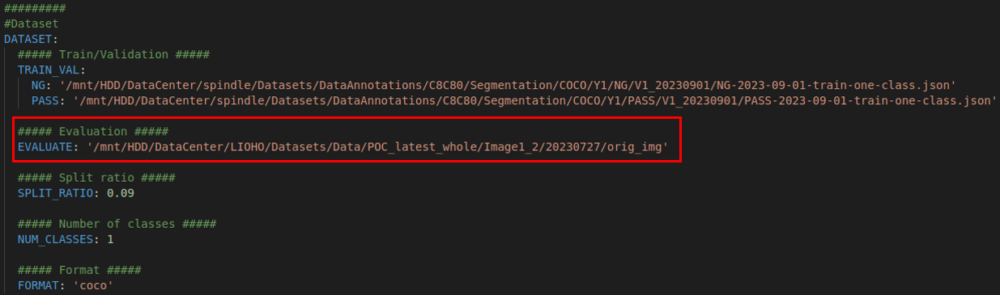

- 實驗紀錄/存檔路徑參數檔位置:

    

#### Dataset loader
- 指令檔: [main_flow.sh](main_flow.sh)

- 功能: 針對資料載入集(Dataset loader)進行推論, 整體流程如下圖所示:

    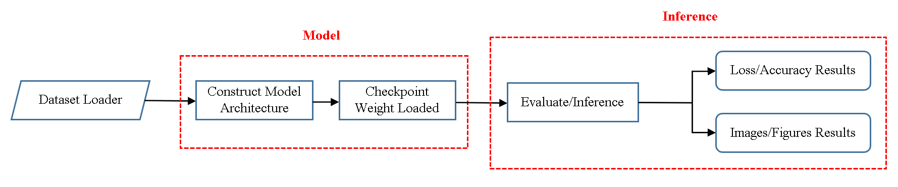

- 執行推論流程: 

    進入到指令檔內部後, 註解掉除了 evaluate 以外的其他相關指令, 如下圖所示:

    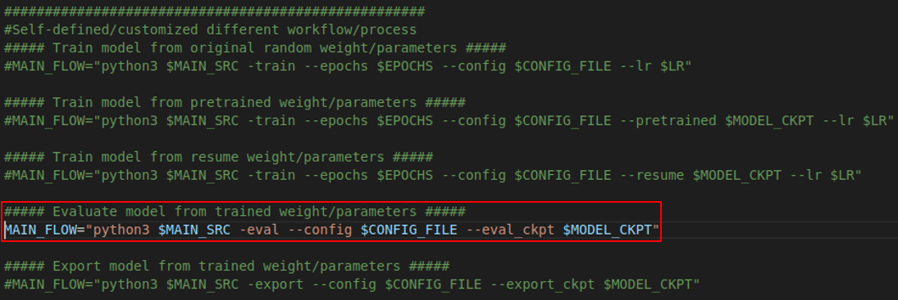

    接著再於終端 (terminal) 執行以下指令:
    ```shell
    ./main_flow.sh
    ```
- 可視化紀錄:
    - 終端: 輸出對於資料載入集(Dataset loader)進行推論的對應進度條資訊, 如下圖所示:

        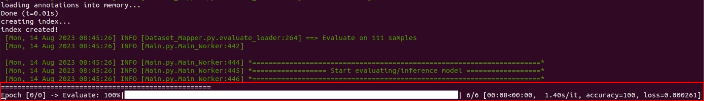

    - Tensorboard前端:

        於終端執行以下指令, 進入到設定的實驗紀錄/存有 Tensorboad event 文件的存檔路徑中:
        ```shell
        cd path_to_output_dir/evaluate_result
        ```
        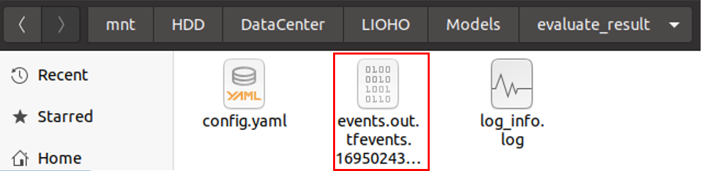
        
        接著執行以下指令, 進入到 Tensorboard 前端可視化界面:
        ```shell
        tensorboard --logdir="." --host=0.0.0.0
        ```
        最後可以看到以下網路連結資訊, 點擊進入:

        
        1. Area under ROC curve (i.e. AUROC) Curve:

            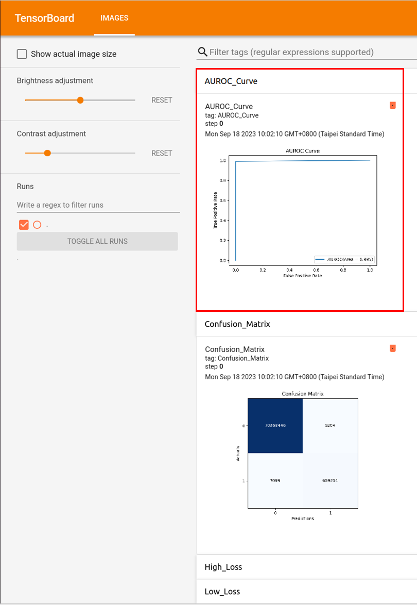

        2. Confusion Matrix:

            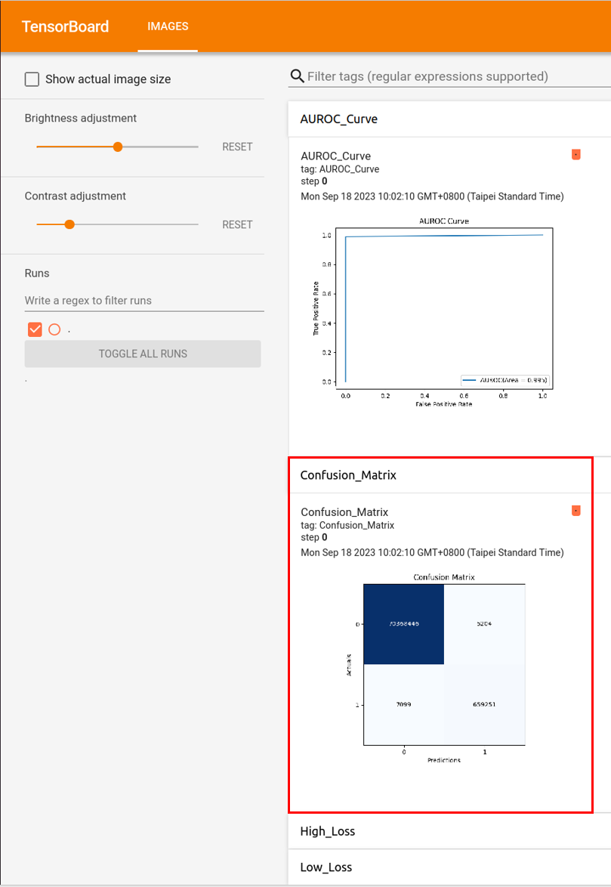

        3. 影像推論結果(Image inference results):

            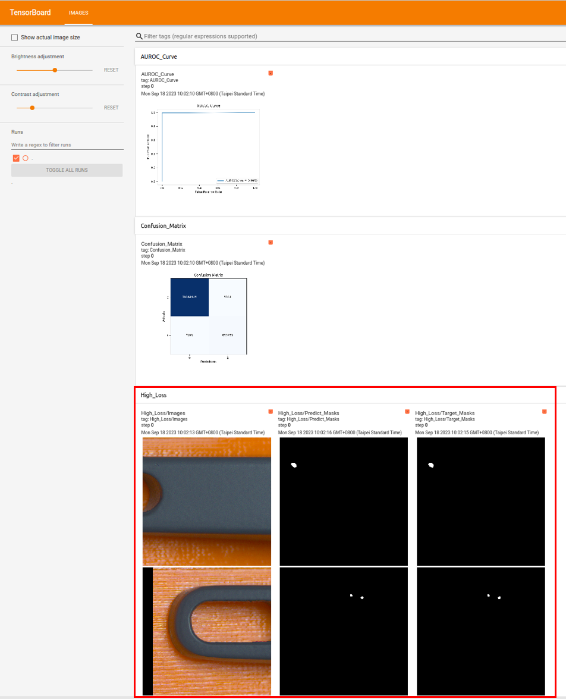

#### Image folder
- 指令檔: [main_flow.sh](main_flow.sh)

- 功能: 針對影像路徑夾(Image folder)進行推論, 整體流程如下圖所示:

    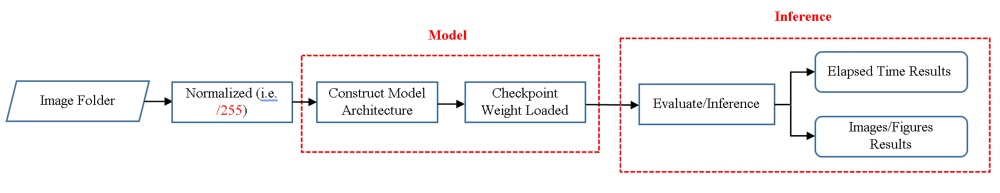

- 執行推論流程: 

    進入到指令檔內部後, 註解掉除了 evaluate 以外的其他相關指令, 如下圖所示:

    

    接著再於終端 (terminal) 執行以下指令:
    ```shell
    ./main_flow.sh
    ```

- 可視化紀錄:
    - 終端: 輸出對於影像路徑夾(Image folder)進行推論的對應效能表現資訊, 如下圖所示:

        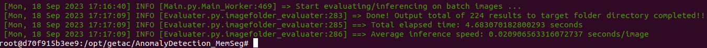

    - 路徑夾端: 

        於終端執行以下指令, 進入到設定的實驗紀錄/存檔路徑中:
        ```shell
        cd path_to_output_dir/evaluate_result
        ```

        進入後即可查看對於影像路徑夾(Image folder)進行推論的圖像結果資訊, 如下圖所示:

        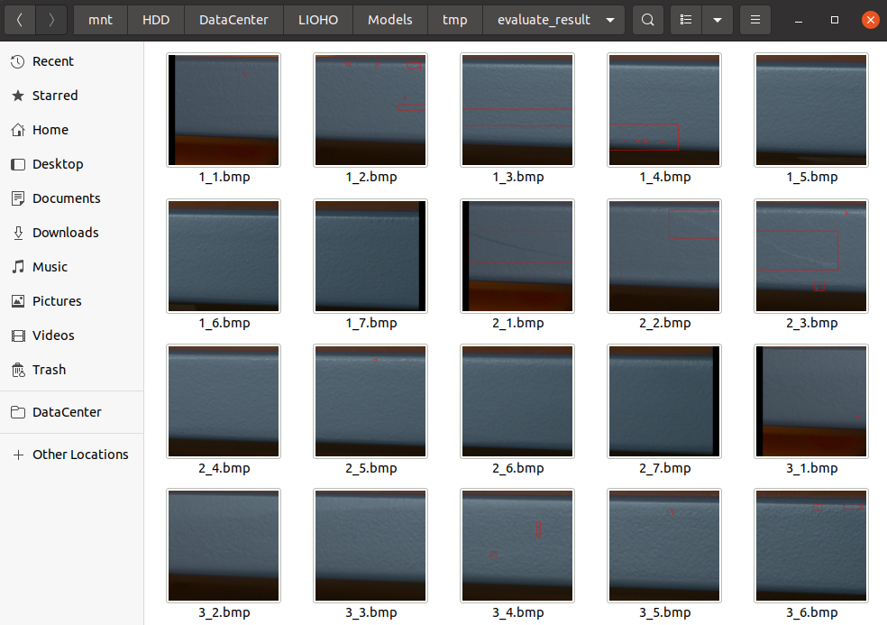

</br>

### Model export (模型匯出)
- 程式檔: [Exporter.py](Exporter.py)

- 指令檔: [main_flow.sh](main_flow.sh)

- 功能: 對於已訓練好的主任務模型架構進行轉換與匯出, 以便後續相關平台/框架的部署/導入及最終場域端的應用落地

- 參數檔位置:

    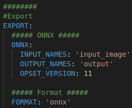

- 執行匯出流程: 

    進入到指令檔內部後, 註解掉除了 export 以外的其他相關指令, 如下圖所示:

    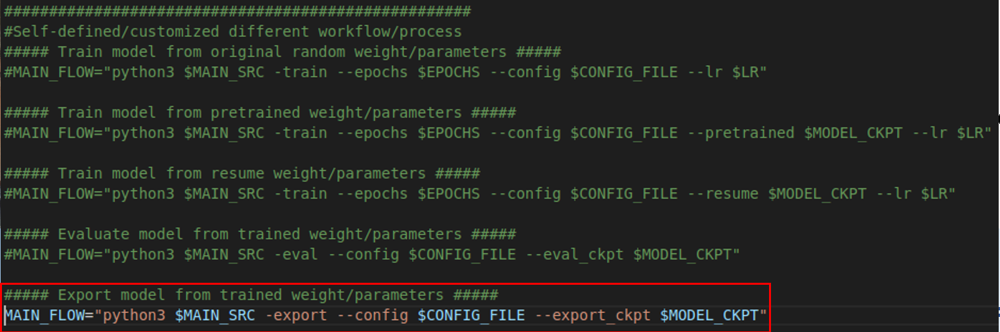

    接著再於終端 (terminal) 執行以下指令:
    ```shell
    ./main_flow.sh
    ```
    完成後即可即時查看模型匯出的細節資訊, 如下圖所示:

    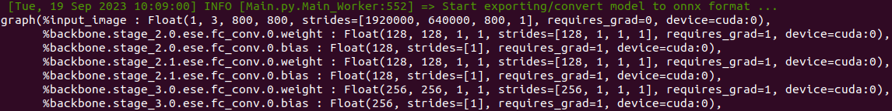
    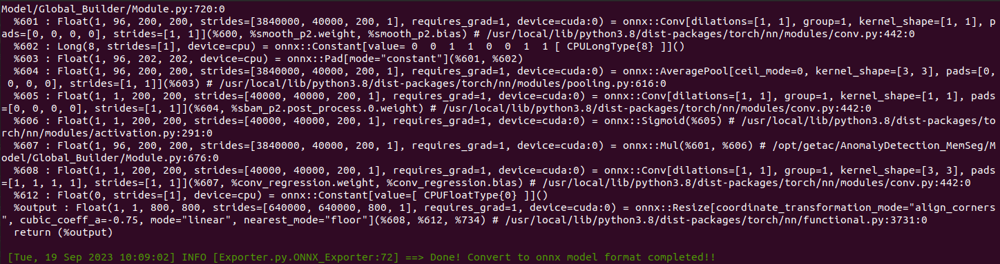

    同時也可進入設定的實驗紀錄/存檔路徑查看匯出模型的存取資訊, 如下圖所示:
    ```shell
    cd path_to_output_dir/export_result
    ```
    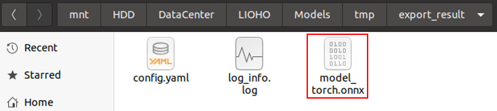

</br>

## Log
- 功能: 於實驗階段過程中 (i.e. 模型訓練/驗證, 模型推論, 模型匯出), 進行所有相關資訊的紀錄, 主要以 .log 以及 .yaml 檔進行紀錄

- 實驗紀錄/存檔路徑參數檔位置:

    

- 查看紀錄的實驗資訊流程:

    - 模型訓練/驗證階段:
    
        於終端執行以下指令, 進入到設定的實驗紀錄/存有實驗資訊紀錄文件的存檔路徑中:
        ```shell
        cd path_to_output_dir/train_result
        ```
        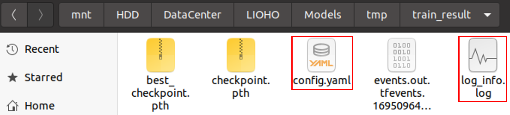

        進入後即可於 .yaml 以及 .log 檔進行所有相關資訊紀錄的查看:

        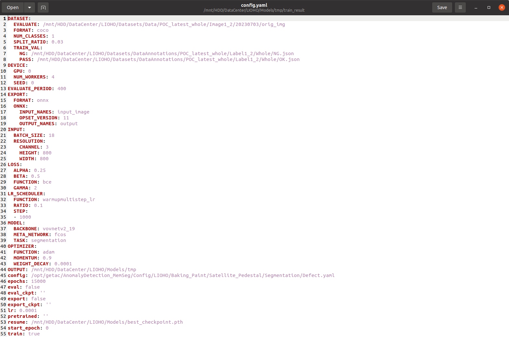

        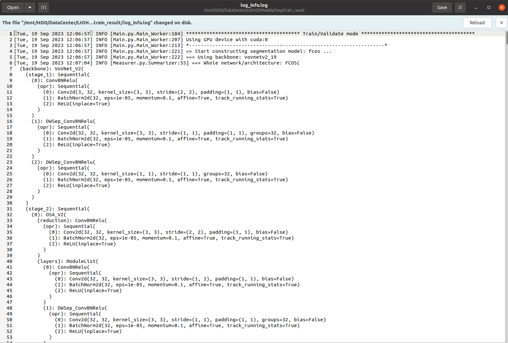

    - 模型推論階段:

        於終端執行以下指令, 進入到設定的實驗紀錄/存有實驗資訊紀錄文件的存檔路徑中:
        ```shell
        cd path_to_output_dir/evaluate_result
        ```
        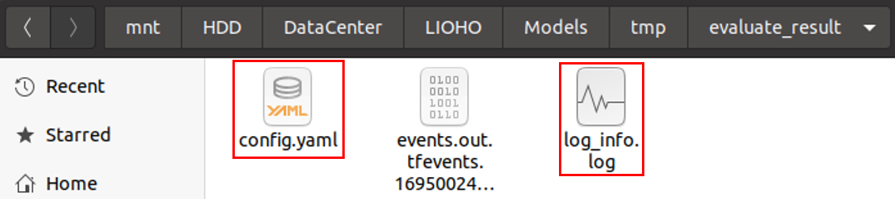

        進入後即可於 .yaml 以及 .log 檔進行所有相關資訊紀錄的查看:

        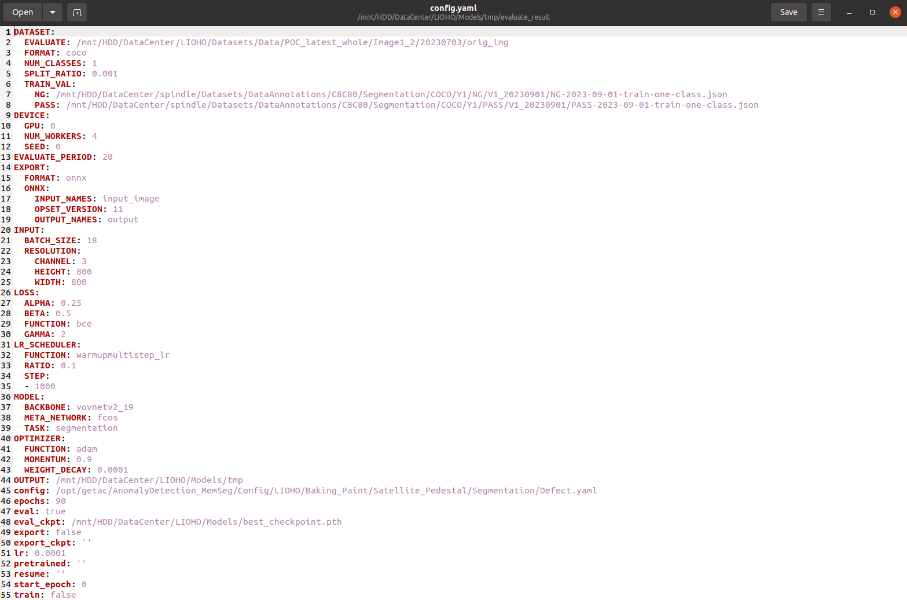

        

    - 模型匯出階段:

        於終端執行以下指令, 進入到設定的實驗紀錄/存有實驗資訊紀錄文件的存檔路徑中:
        ```shell
        cd path_to_output_dir/export_result
        ```
        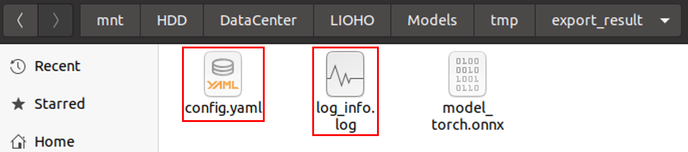

        進入後即可於 .yaml 以及 .log 檔進行所有相關資訊紀錄的查看:

        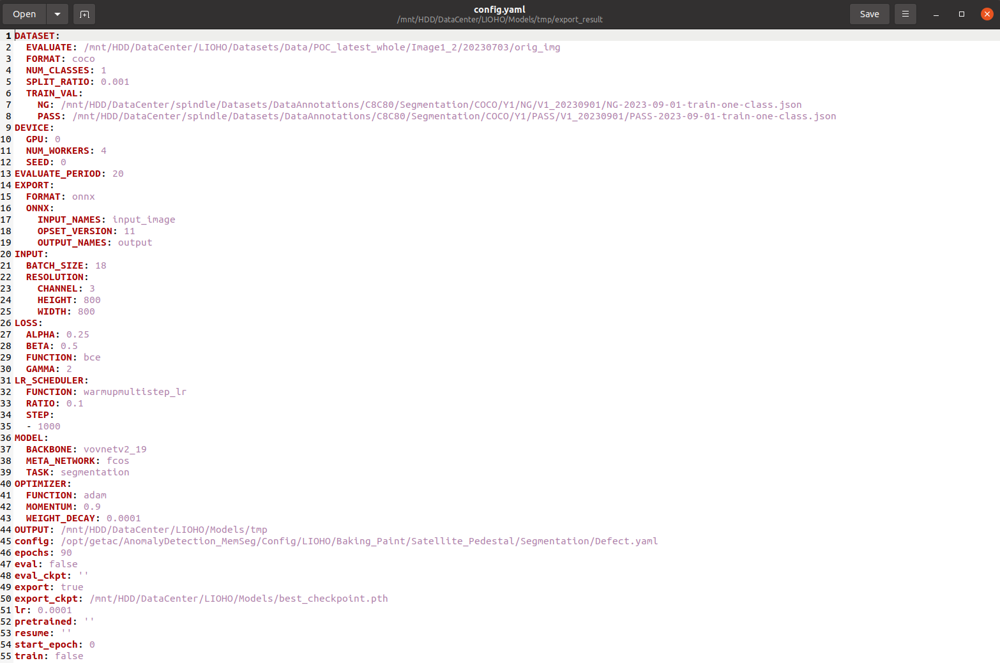

        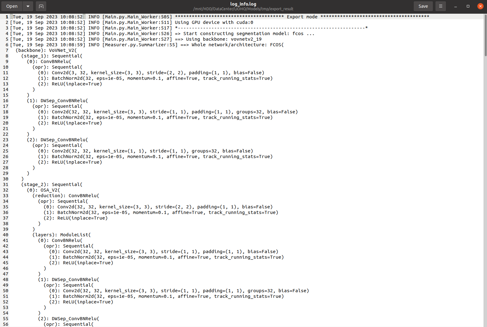


